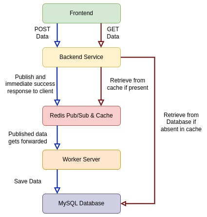

# Microservice Architecture example using Reactjs(Nextjs) Express Redis and Mysql 

## Introduction

<figure > 
<p align="center">
  
  <p align="center">Dataflow Diagram</p> 
</p>
</figure>

Explanation:

1. The nextjs client is the front end of the application and it communicates with the express backend service to get and post data to the worker server and the mysql database.

1. The express backend service is the middle layer of the application. When it receives a post request from the nextjs frontend, it publishes a message to the redis pub/sub. When it receives a get request from the nextjs frontend, it checks the redis cache for the data. If the data is not in the redis cache, it sends a request to the database to get the data and caches the data in the redis cache for future requests. If the data is in the redis cache, it sends the data to the nextjs frontend. It is also responsible for sending responses to the nextjs frontend.

1. The worker server is a microservice that subscribes to the redis pub/sub and receives messages from the backend service when a post request is made from the nextjs frontend. It is responsible for sending requests to the mysql database to store the data.

Components:

1. Frontend service by Nextjs
1. Backend service by Express
1. Worker (Nodejs) Server
1. Redis Cache and Pub/Sub
1. MySQL Database
 

You can try it out yourself by cloning the repository and following the instructions below.

```bash
git clone https://github.com/titocbd/microservice-architecture-example-using-reactjs-express-redis-and-mysql
cd microservice-architecture-example-using-reactjs-express-redis-and-mysql
docker-compose build
docker-compose up
```

Now visit:
http://localhost:3000/


Thanks for reading!
